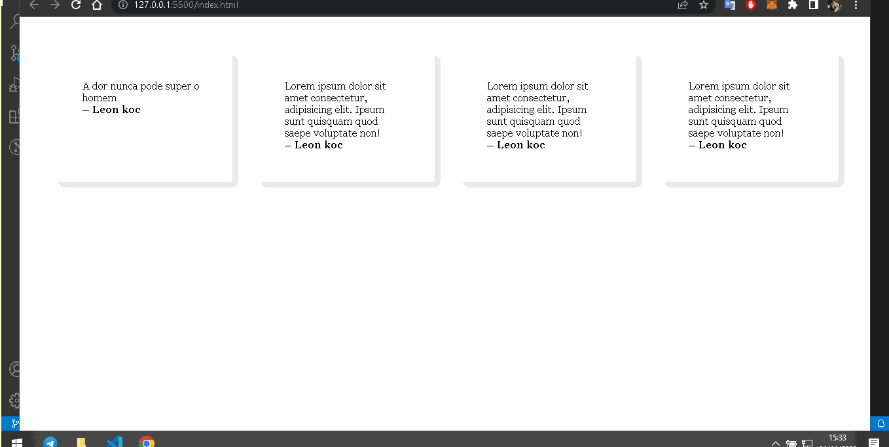

# Cards feitos com grid, sem Media Queries
## Feito durante um estudo sobre responsividade com grid

[]

## Tecnologias utilizadas

-Html

-CSS

## Como utilizar 

```
grid-template-columns: repeat(auto-fit, minmax(250px, 1fr));
```
Uma forma de deixar uma pagina responsiva, sem o uso de Media Queries.